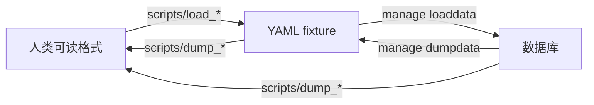

# Fixtures

[`../fixtures/`](../fixtures/)是测试数据。

```shell
$ just manage loaddata ./fixtures/…
# 注意，只识别正斜杠。
```

## 命名规定

接近数据库称作 load，接近人称作 dump。



## 来源

### `NGE.yaml`

从 [FGC:Main - EvaWiki](https://wiki.evageeks.org/FGC:Main) 复制得到`NGE.md`。

> **Note**
>
> 利用以下[用户样式](https://add0n.com/stylus.html)可隐藏不相关内容，方便复制。
>
> ```css
> @-moz-document url-prefix("https://wiki.evageeks.org/FGC:Episode_") {
> .fgc_scenelist td:nth-child(-n+2),
> .fgc_scenelist td:nth-child(n+4) {
>     display: none;
> }
> }
> ```

再用[`load_md_fixture`](../scripts/load_md_fixture.py)转换为`NGE.yaml`。

```shell
$ poetry run python ./scripts/load_md_fixture.py ./fixtures/NGE.md --first-correct
```

目前不常用，故不收入`justfile`。

### `problems.yaml`

来自 PHP 旧项目。

```shell
$ poetry run python ./scripts/load_problems_csv.py ./fixtures/problems.csv
```
