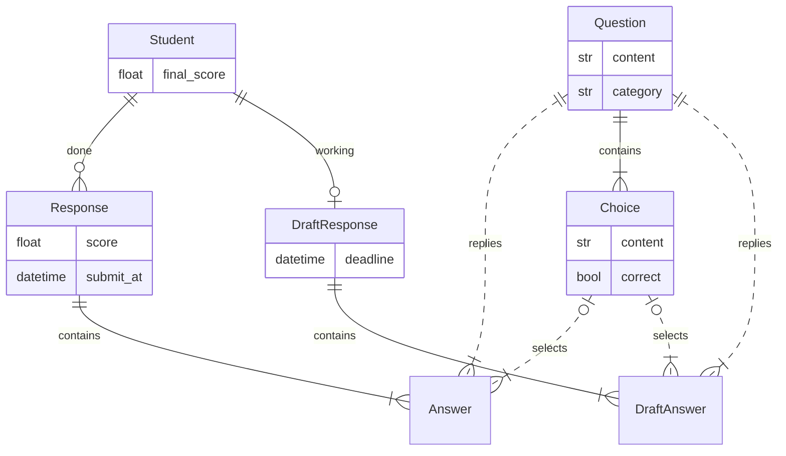

# 模型

## 答题流程

1. 发卷：创建`DraftResponse`，计算并存储`deadline`。
2. 作答：更新`DraftResponse`，更新前用`deadline`验证。
3. 提交：将`DraftResponse`定稿（`finalize`）为`Response`。

## 关系

```mermaid
erDiagram
    Student {
        float final_score
    }


    Response ||--|{ Answer: contains
    Response {
        float score
        datetime submit_at
    }
    Question ||..|{ Answer: replies
    Choice o|..|{ Answer: selects

    Student ||--o{ Response: done


    Question {
        str content
        str category
    }
    Choice {
        str content
        bool correct
    }
    Question ||--|{ Choice: contains

    DraftResponse ||--|{ DraftAnswer: contains
    DraftResponse {
        datetime deadline
    }
    Question ||..|{ DraftAnswer: replies
    Choice o|..|{ DraftAnswer: selects

    Student ||--o| DraftResponse: working
```
