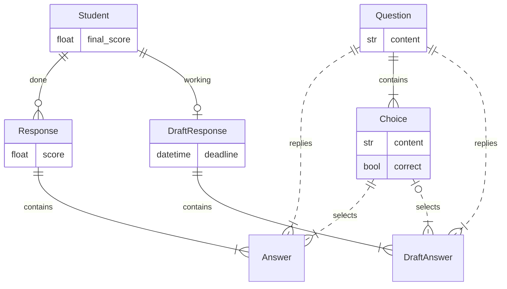

# 模型

```mermaid
erDiagram
    Student {
        float final_score
    }


    Response ||--|{ Answer: contains
    Response {
        float score
    }
    Question ||..|{ Answer: replies
    Choice ||..|{ Answer: selects

    Student ||--o{ Response: done


    Question {
        str content
    }
    Choice {
        str content
        bool correct
    }
    Question ||--|{ Choice: contains

    DraftResponse ||--|{ DraftAnswer: contains
    DraftResponse {
        datetime deadline
    }
    Question ||..|{ DraftAnswer: replies
    Choice o|..|{ DraftAnswer: selects

    Student ||--o| DraftResponse: working
```

