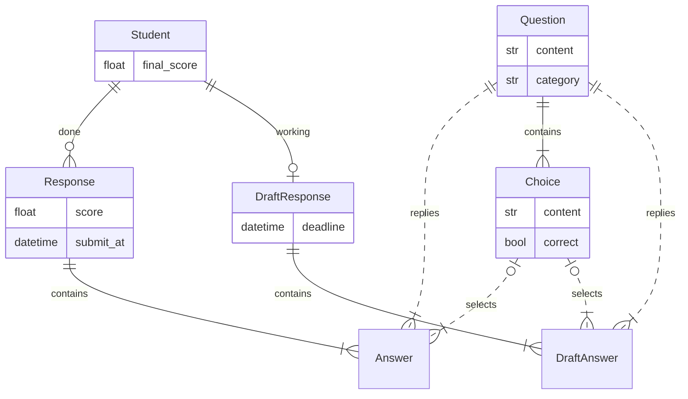

# 模型

## 设置或常量

题目分值等设置或常量分在下面两个文件中。

- **[`contest/settings.py`](../contest/contest/settings.py)的`QUIZ_*`**

  这些设置允许随时修改。例如，竞赛开放时间`QUIZ_OPENING_TIME_INTERVAL`在测试时需要频繁改动，如果不改，就没法测试了。

- **[`quiz/constants.py`](../contest/quiz/constants.py)的`constants.*`**

  这些常量假定单次运行中不变。例如`ROUTES`存储了页面标题，这些标题一直是固定的。

不过这只是基本思想，界限很模糊，`constants.*`未必就不能改。

目前严格要求单次运行中不变的是每种题目的分值`constants.SCORE`，因为`response.score()`有全局缓存——`constants.SCORE`一变，缓存就失效了。

## 答题流程

1. 发卷：创建`DraftResponse`，计算并存储`deadline`。
2. 作答：更新`DraftResponse`，更新前用`deadline`验证。
3. 提交：将`DraftResponse`定稿（`finalize`）为`Response`。

## 关系

> **Note**
>
> 以上是设计稿，其中有些属性并未存入数据库，而只是类的方法。[django-extensions](https://pypi.org/project/django-extensions/) 的 [graph models](https://django-extensions.readthedocs.io/en/latest/graph_models.html) 可自动生成实际关系图，并且包括 Django 内置的`User`、`Session`等。

数据库并不直接存储分数——需要时再结合`constants`计算。
